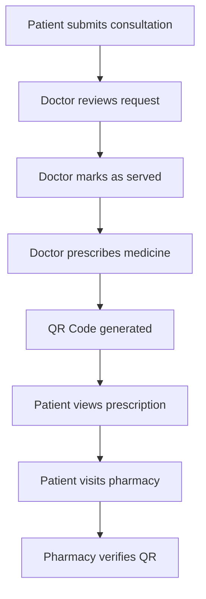
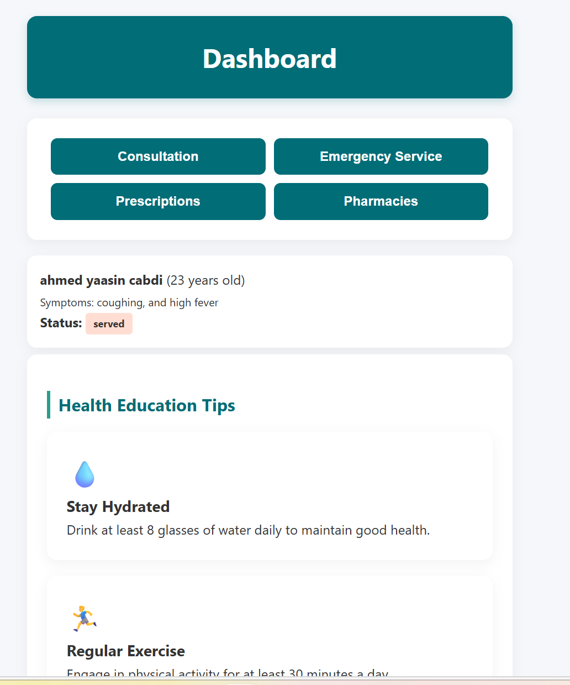
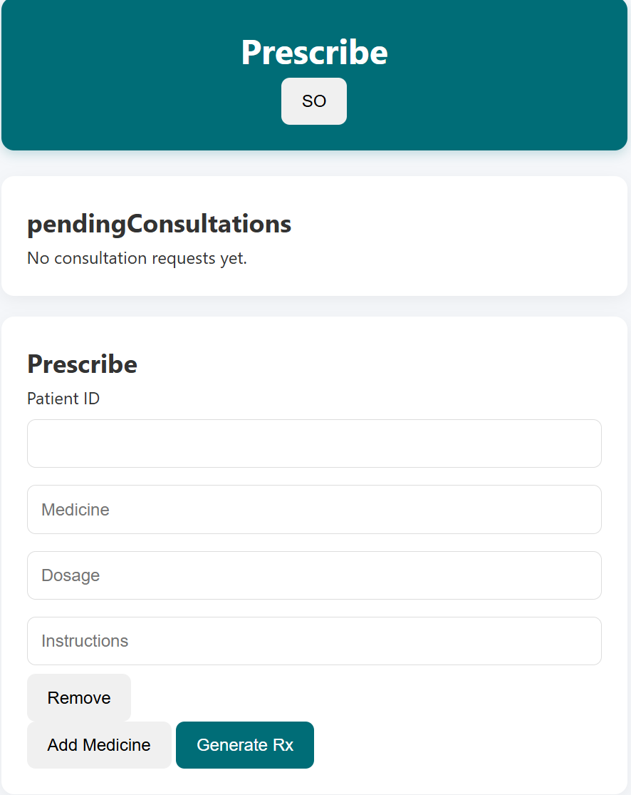
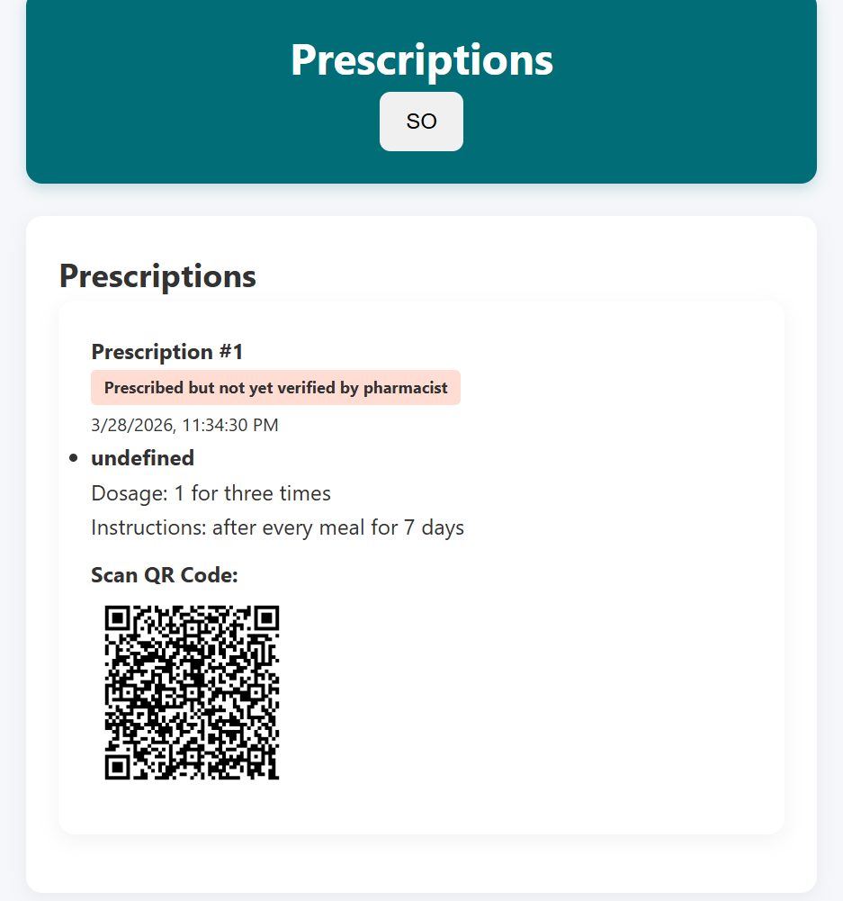
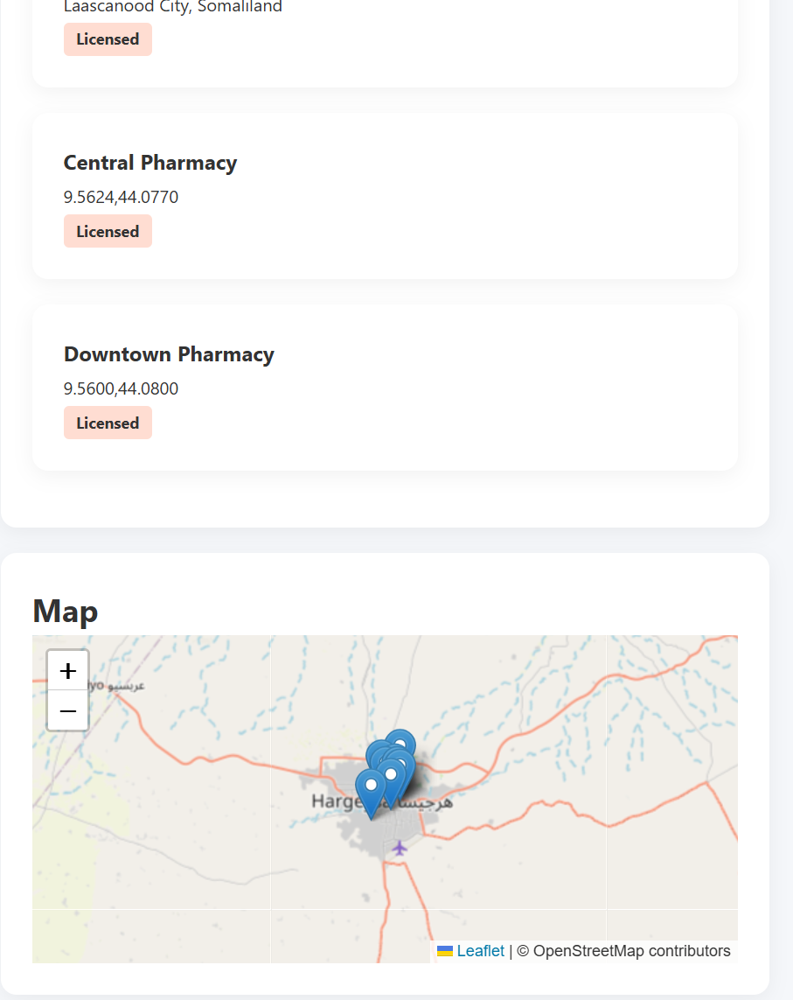

# 🏥 E-Health Somaliland Platform


---

## 🌍 Overview

The **E-Health Somaliland Platform** is a full-stack healthcare system designed to digitize medical services and improve access to healthcare across Somaliland.

It connects **patients, doctors, and pharmacies** into a single ecosystem, enabling a seamless workflow from consultation to prescription verification.

---

## 🎯 Vision & Impact

This project aims to:

* 🏥 Improve healthcare accessibility in underserved regions
* ⚖️ Promote fairness and transparency in medical services
* 📲 Replace manual systems with digital workflows
* 🔐 Prevent prescription fraud using QR verification
* 🌍 Build scalable health-tech solutions for Africa

---

## ✨ Features

* 📋 Consultation request system
* 👨‍⚕️ Doctor dashboard for managing patients
* 💊 Digital prescription system
* 🔐 Role-based authentication (Patient / Doctor)
* 📱 QR Code generation for prescriptions
* 🗺️ Interactive pharmacy map (Somaliland-wide)
* 🌐 Multi-language support (English / Somali)

---

## 🔄 System Workflow



---

## 👥 User Roles

### 🧑‍⚕️ Patient

* Register & login
* Request consultations
* Track consultation status
* View prescriptions + QR codes
* Find nearby pharmacies

---

### 👨‍⚕️ Doctor

* View consultation requests
* Serve patients
* Issue prescriptions
* Generate QR codes

---

### 💊 Pharmacy *(Future Enhancement)*

* Scan QR codes
* Verify prescriptions
* Dispense medication

---

## 🛠️ Tech Stack

### Frontend

* HTML
* CSS
* JavaScript
* Leaflet.js (Maps)

### Backend

* Node.js
* Express.js

### Database

* SQLite (Knex.js)

### DevOps

* Docker
* HAProxy (Load Balancer)

---

## 📸 Screenshots

📌 screenshots here after running the app

### 🧑‍⚕️ Patient Dashboard


### 👨‍⚕️ Doctor Panel


### 💊 Prescription with QR Code


### 🗺️ Pharmacy Map

---

## 🚀 Installation Guide

### 1️⃣ Clone Repository

```bash
git clone <your-repo-url>
cd e-health-platform
```

---

### 2️⃣ Setup Backend

```bash
cd backend
npm install
npm run dev
```

---

### 3️⃣ Run Frontend

Open:

```
frontend/index.html
```

OR use Live Server (recommended)

---

## 🧪 How to Test

### Patient Flow

1. Register as patient
2. Submit consultation
3. Check status
4. View prescription + QR

---

### Doctor Flow

1. Login as doctor
2. View consultations
3. Serve request
4. Prescribe medicine

---

## 📡 Key API Endpoints

### Patient

* `POST /consultations`
* `GET /patients/prescriptions`
* `GET /patients/pharmacies`

### Doctor

* `GET /doctor/consultations`
* `PATCH /doctor/consultations/:id/serve`
* `POST /doctor/prescribe`

---

## 🔐 QR Code System

Each prescription generates a QR code containing:

```json
{
  "prescription_id": "...",
  "patient_name": "...",
  "doctor_name": "...",
  "doctor_phone": "...",
  "doctor_email": "...",
  "hospital_name": "...",
  "medicines": [...]
}
```

✔ Enables verification
✔ Prevents fraud
✔ Improves trust

---

## 🌍 Pharmacy Integration

Includes pharmacies from:

* Hargeisa
* Berbera
* Borama
* Burco
* Gabiley
* Ceerigaabo

📍 Displayed on interactive map

---

## ⚠️ System Status & Notes

* **Data Persistence:** Uses SQLite for development; data may reset if the database file is manually deleted.
* **Camera Permissions:** Ensure your browser allows camera access for the Prescription Verification feature.
* **Multilingual Support:** Somali (SO) and English (EN) are fully integrated; additional regional dialects are planned.

---

## 🔮 Roadmap & Future Vision

* **🤖 AI-Assisted Diagnosis:** Integrating a Lightweight LLM to help doctors analyze symptoms faster.
* **🔔 Real-time Alerts:** implementing WebSockets for instant emergency "Adeegga Degdegga ah" notifications.
* **💳 E-Dahab & Zaad Integration:** Seamless payment for consultations and prescriptions.
* **📱 Native Mobile App:** Dedicated iOS and Android versions for better accessibility in rural areas.
* **🏥 Hospital Network Expansion:** Connecting major hospitals in Hargeisa and beyond to a centralized patient history database.

---

## 👨‍💻 Author

**Saddam Daahir Adam**
Software Engineering Student
African Leadership University(ALU)

---

## ⭐ Contributing

Contributions are welcome!
Feel free to fork this repository and submit a pull request.

---

## 📜 License

This project is for educational purposes.

---

## 💡 Final Thought

This project demonstrates how **technology can transform healthcare systems in Africa**, making them more accessible, efficient, and transparent.

---
